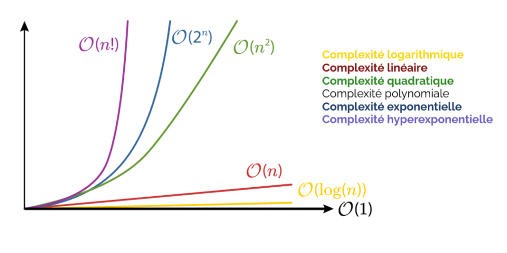

# La complexité 

> [!IMPORTANT]
> NON ! La complexité d'un algorithme ne définit pas à quel point un algorithme est complexe(difficile)
> La __complexité__ ou __coût__ d'un algorithme permet de définir la quantité de resssources nécessaire à son exécution.  

> [!WARNING]  
> La complexité se mesure toujours en fonction de __LA TAILLE DES DONNEES EN ENTREE__ de notre algorithme.    

## Complexité en temps  
Il existe 2 grands types de complexité. 
- __La complexité en temps__ : "Combien" de temps notre algorithme va s'exécuter.
- La complexité en espace : "Combien" d'espace mémoire notre algorithme à besoin pour s'exécuter.  

En spécialité NSI, nous allons nous intéresser à la __complexité en temps__.


## Comment définir la complexité d'un algorithme  

Pour calculer la complexité d'un algorithme il faut choisir ce que l'on compte dans celui ci.  
Plusieurs choix soffrent à nous.  
Compter les opérations arithmétiques (`+`, `*`, `-`, `/` , `//`, etc...) aurait pu être une solution, mais cela est peu représentatif car elles sont peu coûteuse.   

Les opérations les plus coûteuses dans un alorithme sont __les comparaisons__ (`<`, `>=`, `==`, ...).   

Ainsi, pour définir la complexité d'un algorithme il suffit de compter le nombre de comparaison qu'il effectue en fonction de __LA TAILLE DES DONNEES EN ENTREE__.  


### Exemple  

Quel est la complexité de l'algorithme suivant ? 

```Python
def mystere(l):
    res = []
    for nombre in l:
        if ((nombre % 2) == 0) and (nombre <= 10):
            res.append(nombre)
    return res
```

On note toujours __n__ la taille des donnees en entrée.  
On remarque qu'il y a __2__ comparaisons dans cette fonction pour chaque `nombre` dans `l`.  
Autrement dit :
- si `l` est de taille `1` on aura une complexité de `2 * 1`.    
- si `l` est de taille `4` on aura une complexité de `2 * 4`.     
- Or, on note de manière générale __n__ la taille des donnée en entrée. Ainsi `l` est de taille `n` on a donc une complexité de `2 * n`.  

Lorsqu'on note la complexité on enlève la constante associée au n (ici la constante vaut 2).   

On à donc une complexité en n on note __O(n)__.  


## Classe de complexité  

Il existe différentes __classe de complexité__.  

- 0(1) : complexité constante   
- __0(log(n))__ : _complexité logarithmique_    
- __O(n)__ : _complexité linéaire_  
- O(n log(n)) : _complexité "linéarithmique"_
- __O(n²)__ : _complexité quadratique_




## Importance de la complexité   

Il existe plusieurs façon d'écrire un algorithme.  
Les scientifiques ont souhaité définir ce qui categorisait un algorithme plus efficace qu'un autre c'est ainsi que l'étude de la complexité a vue le jour.  
On cherche de manière générale à avoir des algorithmes dans __une classe de complexité basse__    
