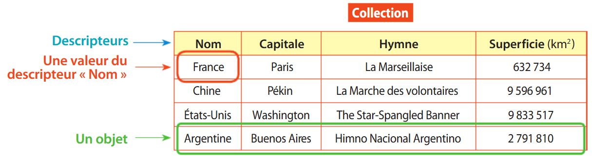
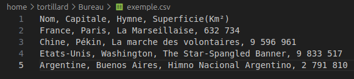

# Traitement de données en tables  

## Introduction
Lorsque l'on souhaite manipuler une grande quantité de données(listes d'élèves dans un lycée, patient dans un hôpital, progression de plusieurs joueurs en ligne, ...) on utilise __une base de données__. 
Le cours sur le traitement des __données en tables__ est un prérequis pour les bases de données qui seront abordées en terminale NSI.    

## Généralités  
Les tables permettent d'organiser une grande quantité de données.  
Une table correspond à une grande __liste__ de d'objets représentés généralement par des __tuples__, où chaque tuple partagent les mêmes __descripteurs__. 



## Fichiers CSV
Il existe certains logiciel qui permettent de manipuler des tables, c'est ce qu'on appel des tableurs(LibreOffice Calc, ...).  
Une table peut être écrit dans différents formats. Un format de fichier simple d'utilisation et bien connu pour les tables est le format __CSV__.  


> [!IMPORTANT]
> L'extension `.csv` signifie `comma separate value` en français `valeur séparé par des virgule`.

> [!IMPORTANT]
> Les fichiers `.csv` sont généralement constituée comme suit :   
> - La première ligne définit les __attributs__ de nos données  
> - Le reste des lignes constituent l'ensemble de nos données   
>   - Une ligne représente une donnée, appelée également un __enregistrement__   
>   - Chaque __enregistrement__ possède des __valeurs__ associées aux __attributs__ et séparés par des virgules(ou point-virgules, ...)

> [!TIP]
> Vous pouvez ouvrir un fichier `.csv` avec un éditeur de texte(bloc-notes par exemple) pour voir à quoi ressemble votre fichier. 

  


## Module en Python  
Le module `csv` en Python permet de manipuler(écrire, lire, ...) les fichiers __CSV__.  
En générale on utilise ce module pour lire un fichier csv et récupérer les données sous forme de liste de dictionnaires.  
Chaque dictionnaire correspond à __un objet__. Les __clés__ du dictionnaire sont les __descripteurs__ et les __valeurs__ du dictionnaire sont les __valeurs attribué à l'objet__.

Pour ce faire, on utilise la fonction `DictReader` du module `csv`.  
Cette fonction permet de créer un objet de type `DictReader` qui lit le fichier csv.  
Afin de récupérer les informations du fichier il suffit d'itérer sur l'objet DictReader avec une boucle.  
A chaque itération, la variable de boucle correspondra à un dictionnaire où les clés et les valeurs seront les mêmes qu'énoncé précédemment.  

Voici un exemple de code permettant de manipuler les fichiers CSV.  

```Python
from csv import *

def from_csv_to_li_dico(nom_de_fichier_csv : str) -> list[dict] :
    res = []
    with open(nom_de_fichier_csv) as file: # on ouvre le fichier csv. Dans la suite du code, ce fichier sera nommé 'file'
        dict_reader = DictReader(file) # on créer un objet DictReader qui lit le fichier csv où chaque ligne est un dictionnaire
        for dico in dict_reader: # Pour chaque dictionnaire de dict_reader
            res.append(dico) # On ajoute le dictionnaire à la liste res
    return res

```

> [!WARNING] 
> Le fichier csv doit être placé au même endroit que le fichier Python pour que le code s'exécute correctement