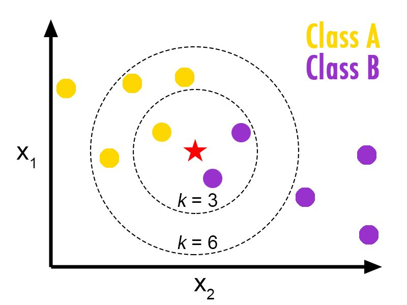
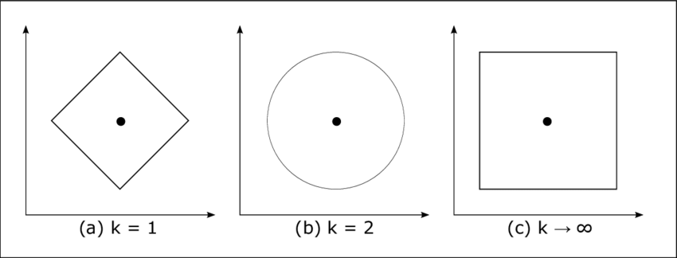
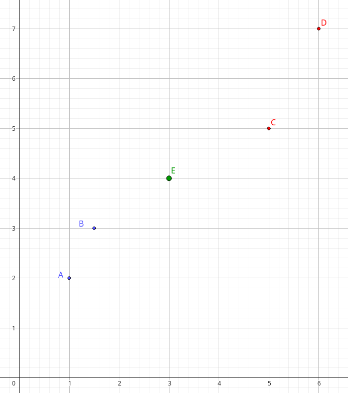
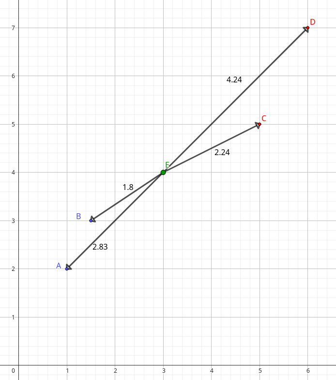

# K-Nearest Neighbors (KNN)

## Introduction

L'algorithme __K-Nearest Neighbors (KNN)__ est une méthode d'apprentissage supervisé utilisée pour la _classification_ et la _régression_. 
Cet algorithme est basé sur le principe suivant : __Plus des données sont _proche_(selon des caractéristiques) plus elles ont des chances pour être similaires__

## Principe

KNN est un algorithme qui classe un nouvel échantillon en fonction des classes des __K__ voisins les plus proches dans l'ensemble de données d'entraînement. 

Lorsque l'on souhaite classer une _nouvelle donnée(nommée __d__)_ à partir de notre grand _jeux de données initiales(nommé __S__)_ à l'aide de __l'algorithme des KNN__ voici les étapes effectuées.  

1. On calcule la __distance__ entre __d__ et toutes les données dans __S__   
2. On trie toutes ces distances (dans l'ordre croissant généralement)  
3. On observe la classe majoritaire dans les __K__ données les plus proches de __d__ afin de lui attribuer la même classe   

  

## Distances  

La __distance__ est un élément central de l'algorithme KNN. 
Il existe plusieurs manière de calculer une distance.  

Généralement on utilise la __distance Euclidienne__(figure (b)) dont la formule est :  
- $euclidienne(d_1, d_2) = \sqrt{(x_1 - x_2)²+(y_1 - y_2)²}$    

Il existe également la _distance de Manhattan_(figure (a)) :
- $manhattan(d_1, d_2) = |(x_1 - x_2)|+|(y_1 - y_2)|$    

Ou encore la distance de Chebyshev (figure(c)) : 
- $chebyshev(d_1, d_2) = max(|(x_1 - x_2)|,|(y_1 - y_2)|)$    

Voici des schémas qui illustre la façon dont les distances sont calculées.  

## Choix de K

__Le choix de K__ est également crucial pour notre algorithme.  
En effet en fonction du nombres de voisins choisi nous avons des inconvénients dans les 2 cas.    

si :
- __K est petit__ : L'échantillon de travail est petit et donc plus facilement faux.    
- __K est grand__ : L'échantillon de travail est plus grand, ce qui permet une détermination plus robuste, en revanche certaines structures locales peuvent être ignorés.  
- __K est pair__ : Lorsqu'on cherche à déterminer une nouvelle donée entre 2 classes il n'est __PAS__ judicieux de choisir un K pair. En effet, prenons K = 6, si 3 voisins sont de la classe A et 3 voisins sont de la classe B on ne peut pas déterminer si notre nouvelle donnée appartient à la classe A ou B.  

## Exemple d'attribution de classe avec KNN

Supposons que nous avons un ensemble de données avec deux classes : Bleu et Rouge.  
On cherche à déterminer la classe du nouveau pont __E__.  

- __Le point à classer__ est E il se trouve à la position (3, 4)  
- __Ensemble d'entraînement__ :  
  - A : (1, 2) de classe Bleu  
  - B : (1.5, 3) de classe Bleu  
  - C : (5, 5) de classe Rouge  
  - D : (6, 7) de classe Rouge  

Maintenant, calculons les distances entre E et tout les points.   

  

Les 3 voisins les plus proches de __E__ sont _A, B et C_. 
Ils sont respectivement de couleur bleu, bleu et rouge.  
La classe majoritaire est le __bleu__, on détermine donc que __le point E__ est de couleur bleu.  

