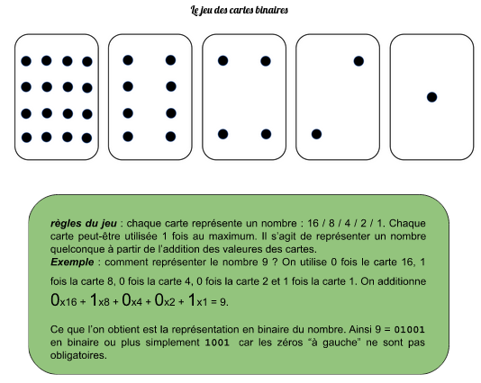

  

## Exercices  

1. Quelle est la représentation binaire de 7 ? 
2. De 14 ?
3. De 23 ?
4. Quel nombre est représenté par 1011 ? 
5. De 11111 ?
6. Comment fait-on pour représenter le nombre 37 ? 
