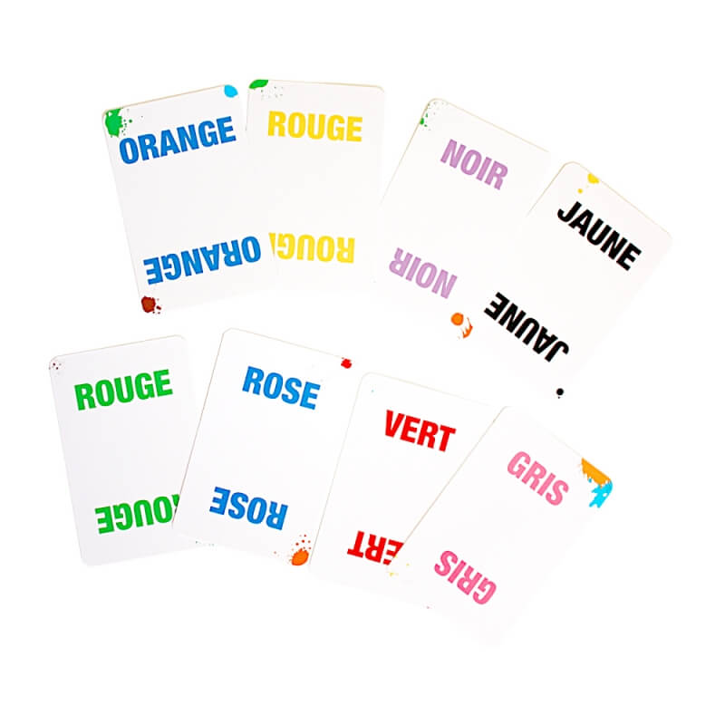
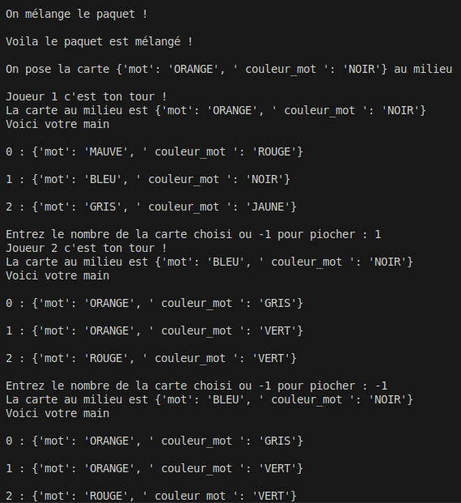

# Color addict   

## Règles 
Le jeu __Color addict__ est un jeu composé de 110 cartes qui peut se jouer de 2 à 6 joueurs.    

Toutes les cartes sont distribuées équitablement entre les joueurs. Chacun garde 3 cartes en main et le reste des cartes constitue une pioche personnelle. Une carte est posé au centre des joueurs.    

Le but pour chaque joueur est de déposé ses cartes le plus vite possible.  

Sur chaque carte est écrit __un mot__ qui peut être écrit dans __une couleur différentes__. Le mot écrit peut être __une couleur__ ou bien le mot __"JOKER"__.   

On peut poser une carte de notre main sur la carte du milieu si au moins une des conditions suivantes est respectées :
- La carte du milieu est un __joker__
- La carte que l'on pose est un __joker__
- Les __couleurs__ présentes sur les cartes __sont les mêmes__
- Les __mots sont les mêmes__
- Le __mot__ correspond à la __couleur__
- La __couleur__ correspond au __mot__

Dans le cas ou aucune des cartes dans la main du joueur ne peut être posés, il prend une carte dans sa pioche personnelle.  

Le premier joueur qui se débarasse de toutes ses cartes gagne !  

## Cahier des charges - Version 1 
Le jeu est entièrement textuelle et se joue à 2 joueurs.    
Dans le jeu original, tout le monde joue en même temps et c'est le plus rapide pose une carte au milieu.  
Il est possible de simuler le fait de jouer en même temps, mais cela n'est pas au programme du lycée. 

Dans cette première version on joue tour par tour une carte de notre main ou on pioche si cela n'est pas possible.

## Cahier des charges - Version 2 
Afin de faire rentrer la vitesse des joueurs dans le jeu, on propose une version du programme où chaque joueur peut jouer pendant 7 secondes.   

Voici un exemple de rendu pour la version 2 :

## Cahier des charges - Version 3
Une version graphique(interactive ou visuelle) qui fait apparaitre les cartes. 

## Cahier des charges - Version 4  
Ajout de la fonctionnalité pour que tout les joueurs puissent jouer en même temps.  
Axes de travail : Module `threading`, ...