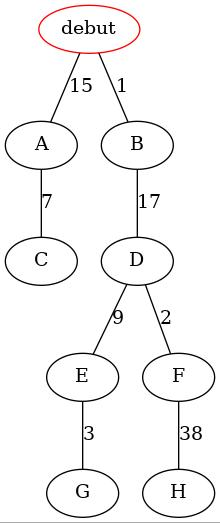

# Algorithme glouton   

## Motivation 
En informatique on peut être amené à résoudre différents type de problèmes.  
Parmi eux ils existent des problèmes d'optimisation combinatoire.   

Pour simplifier nous dirons que A est un problème d'optimisation combinatoire si :  
    - il existe plusieurs solutions qui permet de résoudre A.  
    - Parmis ces solutions, on en cherche une qui fasse partie des meilleurs.  

## Exemple 
Le problème du __rendu de monnaie__ est un problème d'optimisation combinatoire.  
Le but est de rendre une somme d'argent avec un minimum de pièces et de billets utilisés.   

Prenons par exemple le rendu de monnaie avec 16€.   

Il existe différente manière de rendre 16€   
- __3__ billet de 5€ + __1__ pièce de 1 € = __4__ pièces/billets rendus   
- __1__ billet de 10€ + __1__ billet de 5€ + __1__ pièce de 1 € = __3__ pièces/billets rendus   
- __16__ pièce de 1 € = __16__ pièces/billets rendus   
- __8__ pièce de 2 € = __8__ pièces/billets rendus   
- .... 

On à donc plusieurs solutions possibles acceptable. Parmis elles on cherche à savoir laquelle est la meilleure(c'est à dire avec le moins de nombre de pièces/billets rendus). 

Afin de trouver la meilleure solution on pourrait énumérer toutes les possibilités et effectuer une recherche du minimum sur les pièces/billets rendu. Mais cette méthode n'est pas raisonnable car elle est trop coûteuse si on souhaite l'effectuer pour rendre une grosse sommet d'argent(475 372€ par exemple). 

## Définition 
Une autre méthode consiste à utiliser un algorithme glouton. 
Un algorithme glouton est un algorithme qui effectue le meilleur des choix localement, sans revenir sur ces décisions. 

On peut symboliser la démarche gloutonne d'un algorithme par l'exemple suivant : 

Ce schéma représente une forêt dans laquelle il y a plusieurs chemins. Chaque chemins de la forêt.  

## Exemples 

