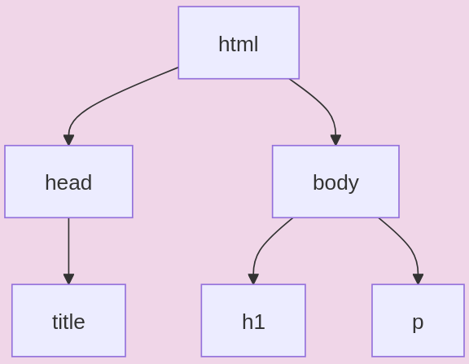

# HTML, CSS, JS  

## HTML  

### Généralités  

Le langage __HTML__ (HyperText Markup Language) est un langage de description.  
Il permet de créer des pages Web et plus précisément de décrire leur __contenu__.  
C'est dans le code HTML que l'on précise  __le texte, la vidéo, le son, le lien, etc...__ que l'on souhaite inclure dans notre page.
Enfin, il est possible d'écrire le code nécessaire pour séparer correctement les éléments(différentes zones) de notre page(section, div, ...).   

### Syntaxe  
Le langage HTML est un langage de __balisages__. On entoure de __balises__ les _éléments_ de notre site.  
On définit une balise avec les caractères `<` et `>`.  
Par exemple, la balise `<p>` permet de définir un paragraphe.  

> [!WARNING] 
> Chaque __balise ouvrante__ est associée à une __balise fermante__ (sauf quelques exceptions).  
> De manière générale on a `<balise ouvrante> contenu </balise fermante>` 
> Exemple : `<p> Dans le murmure des feuilles, le temps s'éveille en douceur. </p>` 

> [!TIP]
> Il n'y a pas d'histoire d'indentation ou de : concernant le langage HTML.
> Ainsi, il est totalement possible d'écrire le contenu d'une page web sur une seule ligne !
> Cela fait évidemment le bonheur des élèves, mais également le cauchemar de tous les professeurs.
> __Autrement dit, l'écriture d'un code "propre" repose sur vous__. Il est essentiel de passer des lignes quand c'est nécessaire, mais également de fournir une indentation pour obtenir une hiérarchie visuelle des balises."

Par exemple les deux codes HTML suivants sont équivalents : 
Exemple 1 :
```HTML
<!DOCTYPE html><html lang="fr"><head><meta charset="UTF-8"><meta name="viewport" content="width=device-width, initial-scale=1.0"><title>Exemple de Page HTML</title></head><body><h1>Bienvenue sur ma page web</h1><h2>Introduction</h2><p>Ceci est un exemple de paragraphe pour illustrer l'utilisation des balises HTML.</p><h2>À propos</h2><p>HTML est le langage de balisage standard pour créer des pages web.</p></body></html>

```
Exemple 2 :
```HTML
<!DOCTYPE html>
<html lang="fr">
<head>
    <meta charset="UTF-8">
    <meta name="viewport" content="width=device-width, initial-scale=1.0">
    <title>Exemple de Page HTML</title>
</head>
<body>
    <h1>Bienvenue sur ma page web</h1>
    <h2>Introduction</h2>
    <p>Ceci est un exemple de paragraphe pour illustrer l'utilisation des balises HTML.</p>
    <h2>À propos</h2>
    <p>HTML est le langage de balisage standard pour créer des pages web.</p>
</body>
</html>

```

### Code HTML  

Après avoir créer un fichier `index.html`(en général c'est le nom qu'on donne à la page principale) le code minimum qui doit être présent dans notre fichier est le suivant.  
```HTML
<!DOCTYPE html> <!-- On précise que le fichier est en HTML  -->
<html lang="fr"> <!-- On ouvre une balise nommé html, ici l'attribut "lang" précise la langue utilisé dans ce fichier  -->

    <head> <!-- Déclaration de la tête de notre page. La tête de page sert à contenir les métadonnées de notre page -->
        <meta charset="UTF-8"> <!-- Par exemple la balise meta précise l'ensemble de caractère utilisé ici "UTF-8" -->
    </head>

    <body> <!-- Déclaration du corps de notre page --> 

        <!-- Ici on écrit le contenu de notre page -->            

    </body>
</html>

```

Une liste __non exhaustive__ des balises HTML est disponible  dans la section __Glossaire des balises HTML__.  

## CSS  

### Généralités  

Le langage __CSS__ (Cascading Style Sheet) permet de se concentrer sur la __forme__ de notre page web.
Les langages __HTML et CSS__ vont très souvent de pair puisqu'une fois que le contenu de notre page est écrit, on souhaite modifier son apparence.    
C'est dans le code CSS que l'on précise, par exemple, __la couleur de notre texte, la taille que doit prendre une image ou encore si l'on souhaite positionner une vidéo en haut à droite de notre page.__

### Syntaxe  

Le code CSS s'écrit dans un autre fichier que le HTML. Généralement appelé `style.css` on définit à l'intérieur des __règles de style__ pour agir sur le style de notre fichier.  
Une règle css est définie par __un sélecteur__ sur lequel on souhaite agir(pour nous ce sera généralement le nom d'une balise), on écrit ensuite des accolades `{}` à l'intérieur desquelles on définit __les propriétés__ sur lesquelles on souhaite agir ainsi que __la valeur__ dont qu'on leur donne. 

> [!WARNING]
> A la fin de la modification d'une propriété on mets toujours un `;`. 

Exemple :

```CSS

p { /* On agit sur toutes les balises p*/
    color : blue; /* La couleur du texte est bleue */
}

```


### Code CSS  

La première chose à faire lorsqu'on créer un fichier CSS est de le _lier_ à la page HTML dont on souhaite modifier le style.  

Pour cela il faut aller dans le fichier HTML dans la balise `<head>` et ajouter cette ligne :
```HTML
<link rel="stylesheet" href="chemin_vers_le_fichier.css"> <!--Pas besoin de fermer cette balise ! -->
```

Il est maintenant possible de modifier le style de notre page. 
Une liste __non exhaustive__ des propriétés CSS est disponible  dans la section __Glossaire des propriétés CSS__.  


## JS  

### Généralités 

Le langage __JavaScript__ est un langage de programmation qui permet de se concentrer sur le __dynamisme et l'interaction__ de notre page web.

En plus des langages __HTML et CSS__, on ajoute le langage __JavaScript__ sur nos pages web.

C'est grâce au code JS que, lorsque l'on clique sur un bouton sur une page web(par exemple), il se passe quelque chose.
    - Exemples basiques : un message qui s'affiche, une image apparaît, le texte change de couleur.  
    - Exemples un peu plus techniques : animations, communication avec le serveur, validation de __formulaires__ .  


### Syntaxe de base  
La syntaxe du code javascript est "relativement" similaire à celle de Python.  

> [!WARNING]
> Il faut mettre un point-virgule `;` à chaque fin de ligne !    
 


#### Les variables  

Pour déclarer une variable, on doit la précéder d'un mot-clé. Il en existe trois : `var`, `const` et `let`. Vous pouvez vous renseigner sur les différences entre ces trois mots-clés ; dans notre cas, nous utiliserons majoritairement `let` (sauf mention explicite).

Les exemples sont constitués d'un code en Python et de son équivalent en JavaScript.

```Python
a = 3
```

```Javascript
let a = 3;
```

#### Les fonctions, conditions, boucles    

Les fonctions, les conditions et les boucles utilisent des *blocs*, contrairement à Python qui utilise une indentation. Les blocs sont délimités par des accolades `{ }`.  

```Python
def maximum(a, b):
    if a < b:
        return b
    else:
        return a

def compte_jusqua(nb):
    for i in range(nb):
        print(i)

```

```Javascript
function maximum(a, b){
    if (a < b){
        return b;
    }
    else{
        return a;
    }
}

function compte_jusqua(nb){

    for (let i = 0; i < nb; i++) {
        console.log(i);
    }
}

```

#### Les Arrays (Tableaux)  

Il existe une structure de données nommée `Array` en JavaScript. Cette structure permet de regrouper plusieurs données de différents types et d'accéder aux éléments par leur index. Les tableaux sont fondamentalement bien différents des __listes en Python__, mais en première NSI, on peut se permettre de simplifier mentalement utilisant les 2 types de la même manière.

```Python
fruits = ["Pomme", "Poire", "Peche"]
premier_fruit = fruits[0]

```

```Javascript
let fruits = ["Pomme", "Poire", "Peche"];
let premier_fruit = fruits[0];
```

### Les évènements  

Jusqu'à maintenant Javascript ne nous apporte rien de plus que Python.   
La première nouveauté avec ce langage c'est qu'il est possible de récupérer les éléments dans __l'arbre DOM__ de notre page web.   

#### L'arbre DOM  

__L'arbre DOM__ (Document Object Model) est une représentation structurée d'un document HTML. Il permet d'interagir avec le contenu, la structure et le style d'une page web. 

Voici un exemple de code HTML et __l'abre DOM__ qui lui est associée.    

```HTML
<!DOCTYPE html>
<html>
    <head>
        <title>Mon Document</title>
    </head>
    <body>
        <h1>Titre Principal</h1>
        <p>Ceci est un paragraphe.</p>
    </body>
</html>
```  



#### Récupérer un élément de l'arbre DOM  

Il est possible d'identifier un élément de l'arbre DOM en lui ajoutant dans une balise l'attribut `id`.  
Par exemple :  

```HTML
<!DOCTYPE html>
<html>
    <head>
        <title>Mon Document</title>  
    </head>  
    <body>  
        <h1>Titre Principal</h1>  
        <p>Ceci est un paragraphe.</p>  
        <button id="premier_bouton">Appuyer ici</button>  
    </body>  
</html>  
```  

En Javascript on peut ensuite récupérer un élément par son id. Pour cela, on fait appel à l'objet `document` qui représente notre page web et à la méthode qui lui est associée `getElementById()`. Cette méthode prend en paramètre un identifiant.
Par exemple, pour récupérer la balise `<button>` ayant pour identifiant `"premier_bouton"` on écrit le code suivant :  

```javascript
const chapitre_un = document.getElementById("premier_bouton");  
```  


#### Association d'évènement   

Enfin, maintenant que nous avons accès à notre élément(ici notre bouton), il est possible de lui associer un __évènement__.  
Il existe toute une liste __d'évènements__ possible à associer (passage de souris sur un élément, touche du clavier enfoncé, ...) nous allons associer l'évènement de _clique_ sur notre bouton.  

Pour cela, il faut faire appel à la méthode `addEventListener()` de notre élément qui prend 2 paramètres. 
    - __l'évènement__ qu'on souhaite associer
    - __le nom__ de la fonction à exécuter lors de l'évènement  
  
On écrit donc le code suivant. 


```javascript
chapitre_un.addEventListener("click", afficheMessage);
```

Voici ce que peut contenir le code de la fonction afficheMessage(par exemple)

```javascript
function afficheMessage(){
    alert("Bonjour tout le monde !");
}
```