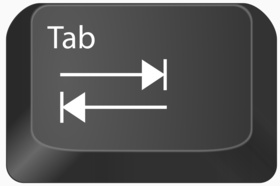

# Les variables  

En programmation, on a souvent besoin de déclarer des variables.
En Python, une variable est liée à __une valeur__ et porte __un nom__. On déclare une variable en lui attribuant un nom puis en utilisant le symbole `=` pour l'affecter à une valeur.      

Le nom d'une variable doit être bien choisi :  
    - Il ne peut pas contenir de caractère spécial ( exemple : ,./"'@(]  )    
    - Il ne peut pas commencer par un nombre  
    - La bonne pratique veut qu'on utilise le symbole `_` pour séparer les différents mots qui compose une variable (exemple `nombre_de_points` ou `texte_de_moliere`)

```Python
# Liste de noms de variables valides  
nom_de_variable = 7
a = 3
_score_du_joueur_11 = 23

# Liste de noms de variables non valides
7nom_de_variable = 7
-a = 3
)score_du_joueur_11 = 23
```

- __Testez les différents noms de variable__  


# Fonctions  

## Définition   
Une fonction est une séquence d'instruction __réutilisable__ à laquelle est associée __un nom__.  

En Python on distingue une fonction d'une variable car une fonction possède __des parenthèses__.  

Vous avez déjà utilisé des fonctions déjà contenues dans Python. 
Par exemple la fonction `int()` permet de convertir en `int` une valeur.

## Définir une fonction  

On peut évidemment définir nos propres fonctions. 
Pour cela il faut :  
    1. utiliser le mot clé `def`  
    2. mettre un espace puis le nom que l'on souhaite attribuer à notre fonction  
    3. on ouvre une parenthèse  
    4. on ajoute éventuellement des paramètres      
    5. on ferme la parenthèse   
    6. __/!\ on ajoute `:` au bout de la ligne /!\\__  
    7. on passe une ligne et on appuie sur la touche tabulation  pour commencer à écrire le code la fonction
    8. Enfin dans la __majorité__ des cas une fonction renvoie un résultat. Le résultat renvoyé par la fonction est précédé par le mot clé `return`.        

Exemples : 
```Python
def une_fonction_sans_parametre():
    a = 2
    return a 

def mon_addition(a, b):
    return a + b

def une_fonction_qui_ne_renvoie_rien(phrase):
    print(phrase)

# La fonction print() affiche un message dans la console mais ne renvoie rien 
# C'est en utilisant le mot clé return que l'on renvoi un résultat

```

## Paramètre  

Un paramètre est une variable qui peut être utilisée à l'intérieur de la fonction.  
On sépare chaque paramètre par une virgule `,`.  

Exemple :
```Python
def une_fonction_avec_4_parametres(nom, prenom, age, ville):
    age_en_str = str(age)
    return "je m'appelle" + " " + prenom + " " + nom + " , j'ai "+ age_en_str + " ans et j'habite à " + ville  
```

Lorsqu'on définit une fonction avec un ou plusieurs paramètres cela signifie que l'on va les utiliser dans notre fonction. Il suffit de réecrire le nom d'un paramètre dans le code de notre fonction pour l'utiliser.    


## Renvoi 

Le mot clé `return` est très important. Il permet de renvoyer le résultat d'une fonction. 
Quand une fonction renvoie un résultat il est possible de réutiliser le résultat renvoyé.  

Par exemple la fonction `str(donnee)` renvoi `donnee` en convertissant son type en `str`.  
On peut donc récupérer le résultat renvoyé, en le stockant dans une variable par exemple.  

Exemple : 
```Python
nombre_de_points = 5
nombre_de_points_sous_en_str = str(nombre_de_points)
 
# on stock le résultat de la fonction str dans la variable nombre_de_points_sous_en_str

```

## Appel de fonction  
Lorsqu'on utilise une fonction on dit __qu'on appelle la fonction__. 
Pour appeler une fonction il suffit :
    - d'écrire son nom  
    - ouvrir la parenthèse    
    - __donner une valeur aux paramètres(si la fonction possède des paramètres)__    
    - fermer la parenthèse  


Exemple :
```Python
# appel de la fonction écrite dans la section "Paramètre"
infos_perso = une_fonction_avec_4_parametres("Turing", "Alan", 41, "Londres")
```

