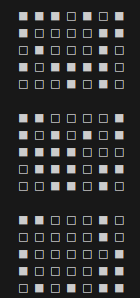

# Jeux de la vie  

## Histoire   

Le jeux de la vie est un jeu à __0 joueur__ imaginé par __John Horton Conway__ en 1970.  

Ce professeur de Mathématiques à l'Université de Cambridge, travaille sur la théorie des groupes et s'intéresse également aux travaux de __John Von Neumann__ sur les machines autoréplicatives.  

Le __jeux de la vie__ est né à l'issue des travaux dans ce domaine.  

## Règles  

Le __jeux de la vie__ est un automate cellulaire, représenté sur une grille en 2 dimensions composé de case aussi appellé _cellules_.   
Chaque cellule possède un état(soit __vivant__ soit __mort__) et un nombres de voisins(__8 au maximum__).       

A chaque tour de jeu, des cases __naissent__, __meurent__ ou __conservent leut état__ selon certaines règles : 
    - Si une cellule a __exactement trois voisines vivantes__, elle est vivante à l’étape suivante.  
    - Si une cellule a __exactement deux voisines vivantes__, elle reste dans son état actuel à l’étape suivante.
    - Si une cellule a __strictement moins de deux__ ou __strictement plus de trois voisines vivantes__, elle meurt à l’étape suivante.  

## Objectifs  

> [!WARNING] Le but de ce projet est de créer un programme découper en plusieurs fonctions qui simule le jeux de la vie.  
> Parmis ces fonction il doit obligatoirement en avoir une nommé `jeu()` qui lance la simulation du jeux de la vie.  

Notre jeu, sera représenté dans un __premier temps__ textuellement dans la console Python par __une chaine de caractère__.    
Voici un exemple sur 3 générations.  

  

__Dans un second temps__ notre jeu sera représenté avec une interface graphique en utilisant la bibliothèque de votre choix(turtle, tkinter, pyqt5, ...).  

## Consigne  

__Programmez le jeux de la vie__

## Sources  

- La page Wikipédia du [jeux de la vie](https://fr.wikipedia.org/wiki/Jeu_de_la_vie)  
- Des implémentations du jeux de la vie [ici](https://playgameoflife.com/) et [là](https://conwaylife.com/)  
- Une vidéo concernant le [jeux de la vie](https://www.youtube.com/watch?v=eMn43As24Bo)