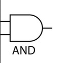
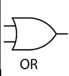
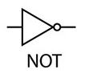
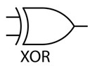
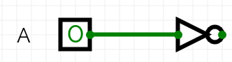
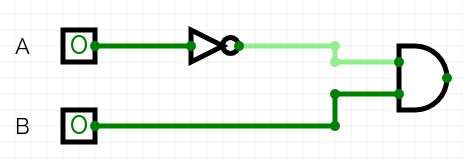
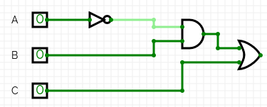

# Booléens    

## Valeurs  

Les booléens ont pour but de représenter les deux valeurs de vérité __Vrai__ ou __Faux__.   
En Python les booléens ont pour type `bool` et les deux valeurs possibles sont `True` ou `False`.    
Ces valeurs sont représentés sur un bit, en __Python__ `False` est associé à `0` (absence de courant) et `True` associé à `1` (présence de courant).  
Cette représentation est propre au langage de programmation, par exemple en javascript c'est la valeur `true` qui est associée à `0`.  

## Opérateurs   

### ET  

__Définition__ : L'opérateur ET (AND) renvoie vrai (True) si et seulement si les deux opérandes sont vrais. Sinon, il renvoie faux (False). Sa notation en Python est `and`.  
    
__Table de vérité__ :

|   A   |   B   | A AND B |
| :---: | :---: | :-----: |
| Faux  | Faux  |  Faux   |
| Faux  | Vrai  |  Faux   |
| Vrai  | Faux  |  Faux   |
| Vrai  | Vrai  |  Vrai   |

__Utilisation__ : Utilisé dans des conditions où plusieurs critères doivent être remplis. Par exemple, dans un programme, on peut vérifier si *un utilisateur a les droits d'accès __et__ si son compte est actif.*  

### OU

__Définition__ : L'opérateur OU (OR) renvoie vrai (true) si au moins un des opérandes est vrai. Il ne renvoie faux (false) que si les deux opérandes sont faux. Sa notation en Python est `or`.  

__Table de vérité__: 

|   A   |   B   | A OR B |
| :---: | :---: | :----: |
| Faux  | Faux  |  Faux  |
| Faux  | Vrai  |  Vrai  |
| Vrai  | Faux  |  Vrai  |
| Vrai  | Vrai  |  Vrai  |

__Utilisation__ : Utilisé pour vérifier si au moins une condition est remplie. Par exemple, dans un système de sécurité, un accès peut être accordé *si l'utilisateur a __soit__ un mot de passe correct, __soit__ une empreinte digitale valide, __soit__ les deux.*

### NON 

__Définition__ : L'opérateur NON (NOT) inverse la valeur de vérité de son opérande. Si l'opérande est vrai, il renvoie faux, et vice versa. Sa notationen Python est `not`.    

__Table de vérité__: 

|   A   | NOT A |
| :---: | :---: |
| Faux  | Vrai  |
| Vrai  | Faux  |

__Utilisation__ : Utilisé pour inverser une condition. Par exemple, dans un programme, on peut vérifier si *un utilisateur __n'est pas__ connecté avant de lui permettre d'accéder à une page de connexion.*

### OU exclusif

__Définition__ : L'opérateur OU exclusif (XOR) renvoie vrai (true) si exactement un des opérandes est vrai. Il renvoie faux (false) si les deux opérandes sont vrais ou si les deux sont faux.

__Table de vérité :__

|   A   |   B   | A XOR B |
| :---: | :---: | :-----: |
| Faux  | Faux  |  Faux   |
| Faux  | Vrai  |  Vrai   |
| Vrao  | Faux  |  Vrai   |
| Vrai  | Vrai  |  Faux   |

__Utilisation__ : Utilisé dans des situations où une seule condition doit être vraie. Par exemple, *dans un jeu, un joueur peut gagner si __un seul des deux critères__ est rempli.*

## Expression booléennes   

### Définition 
__Une expression booléenne__ est une combinaison de valeurs booléennes (vrai ou faux) et d'opérateurs booléens (ET, OU, NON, etc.) qui produit également une valeur booléenne.  

Par exemple, l'expression `A AND (B OR NOT C)` est une expression booléenne qui combine les valeurs de A, B et C à l'aide d'opérateurs.    

### Construction d'expressions
Pour construire une expression booléenne il nous faut 2 éléments :  
    - Des __variables booléennes__, des variables qui ont pour valeur __Vrai__ ou __Faux__   
    - Des __opérateurs booléens__, par exemple __AND__, __NOT__, __OR__, ...  

Simplification d'expressions
        Techniques de simplification (lois de De Morgan, identités booléennes).
         pratiques
        Exercices de création et de simplification d'expressions booléennes.

## Circuits logique    
Un circuit logique est un assemblage de composants électroniques qui effectue des opérations logiques sur des signaux binaires. Ces circuits utilisent des portes logiques pour réaliser des fonctions booléennes, permettant ainsi de prendre des décisions basées sur des entrées numériques.  

Les circuits logiques sont fondamentaux dans la conception des systèmes numériques. Ils sont utilisés dans presque tous les appareils électroniques modernes, des ordinateurs aux téléphones portables, en passant par les systèmes embarqués.   Leur capacité à traiter des informations sous forme binaire est essentielle pour le fonctionnement des algorithmes, le stockage de données et la communication entre dispositifs.  

### Les portes logiques         

Description des portes logiques Les portes logiques sont les éléments de base des circuits logiques. Voici les principales portes logiques :  
    - Porte ET : Produit une sortie vraie (1) uniquement si toutes les entrées sont vraies.  
      
    - Porte OU : Produit une sortie vraie si au moins une des entrées est vraie.  
      
    - Porte NON : Inverse l'état de l'entrée (0 devient 1 et vice versa).  
      
    - Porte XOR(Ou exclusif) : Produit une sortie vraie si un nombre impair d'entrées est vrai.  
      

### Circuit logique et expression booléenne  

Pour construire un __circuit logique__, on commence par une __expression booléenne__ qui représente la fonction désirée.   
On peut donc à partir d'un __circuit logique__ en déduire une __expression booléenne__ ou inversement.    

Par exemple, l'expression `(NON (A) ET B) OU C` peut être réalisée en utilisant :  
- Une porte `NON` sur A. Pour donner `NON(A)`      
  

- Une `ET` pour NON(A) et B. Pour donner `NON(A) ET B`    
  

- Une porte `OU` sur (NON (A) ET B) et C. Pour donner `(NON(A) ET B) OU C`  

## Tables de vérité  

Une __table de vérité__ est un outil qui permet de représenter toutes les combinaisons possibles des valeurs d'entrée d'une expression booléenne et les résultats correspondants.  
Elle est utilisée pour analyser et comprendre le comportement d'une expression booléenne ou d'un circuit logique.  

Dressons la table de vérité de l'expression `(NON (A) ET B) OU C`.  

Pour dresser une table de vérité il faut tout d'abord dresser une colonne pour chaque variable de notre expression.    
On remplit ces colonnes par des `0` et des `1` (ou `Faux` et `Vrai`), de telles sortes à ce que l'on puisse évaluer toutes les combinaisons possibles de valeur booléennes entre les variables.  

|   A   |   B   |   C   |
| :---: | :---: | :---: |
|   0   |   0   |   0   |
|   0   |   0   |   1   |
|   0   |   1   |   0   |
|   0   |   1   |   1   |
|   1   |   0   |   0   |
|   1   |   0   |   1   |
|   1   |   1   |   0   |
|   1   |   1   |   1   |

Ensuite on rajoute des colonnes pour évaluer l'opérateur NON sur ces variables si l'expression booléennes en contient. Dans notre exemple c'est le cas pour `NON(A)`.  

|   A   |   B   |   C   | NON(A) |
| :---: | :---: | :---: | :----: |
|   0   |   0   |   0   |   1    |
|   0   |   0   |   1   |   1    |
|   0   |   1   |   0   |   1    |
|   0   |   1   |   1   |   1    |
|   1   |   0   |   0   |   0    |
|   1   |   0   |   1   |   0    |
|   1   |   1   |   0   |   0    |
|   1   |   1   |   1   |   0    |

On ajoute ensuite une colonne pour les opérateurs binaire (ET, OU, ...) utilisés dans nos expressions entre 2 variables.  

|   A   |   B   |   C   | NON(A) | NON(A) ET B |
| :---: | :---: | :---: | :----: | :---------: |
|   0   |   0   |   0   |   1    |      0      |
|   0   |   0   |   1   |   1    |      0      |
|   0   |   1   |   0   |   1    |      1      |
|   0   |   1   |   1   |   1    |      1      |
|   1   |   0   |   0   |   0    |      0      |
|   1   |   0   |   1   |   0    |      0      |
|   1   |   1   |   0   |   0    |      0      |
|   1   |   1   |   1   |   0    |      0      |

On repete l'opération pour les opérateurs binaire qui incluent 3 variables, puis 4, etc... 

|   A   |   B   |   C   | NON(A) | NON(A) ET B | NON(A) ET B OU C |
| :---: | :---: | :---: | :----: | :---------: | :--------------: |
|   0   |   0   |   0   |   1    |      0      |        0         |
|   0   |   0   |   1   |   1    |      0      |        1         |
|   0   |   1   |   0   |   1    |      1      |        1         |
|   0   |   1   |   1   |   1    |      1      |        1         |
|   1   |   0   |   0   |   0    |      0      |        0         |
|   1   |   0   |   1   |   0    |      0      |        1         |
|   1   |   1   |   0   |   0    |      0      |        0         |
|   1   |   1   |   1   |   0    |      0      |        1         |  

Enfin la table de vérité permet de montrer pour quelles valeur de vérité de A, B et C l'expression booléenne `NON(A) ET B OU C` est vraie ou fausse. 
