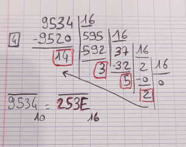

## Exercice 1  

__Tableau de la valeur des puissances de 2__  
| $2^{6}$ | $2^{5}$ | $2^{4}$ | $2^{3}$ | $2^{2}$ | $2^{1}$ | $2^{0}$ |
| :-----: | :-----: | :-----: | :-----: | :-----: | :-----: | :-----: |
|   64    |   32    |   16    |    8    |    4    |    2    |    1    |

__Tableau de l'écriture binaire des nombres de 7 à 13__
|   7   |   8   |   9   |  10   |  11   |  12   |  13   |
| :---: | :---: | :---: | :---: | :---: | :---: | :---: |
|  111  | 1000  | 1001  | 1010  | 1011  | 1100  | 1101  |

## Exercice 2  
Convertissez les nombres suivants de la base 2 à la base 10.  

1. 101 : __5__  
2. 1100 : __12__  
3. 11101 : __29__  
4. 100110 :  __38__  
5. 111111 : __63__  

## Exercice 3  
Convertissez les nombres suivants de la base 10 à la base 2.  

1. 5 : __101__  
2. 14 : __1110__  
3. 25 : __11001__  
4. 37 : __100101__  
5. 100 :  __1100100__  

## Exercice 4
1. Quel est le plus grand nombre que l'on puisse écrire sur 2 bits ? Sur 6 bits ? Sur 10 bits ? Sur n bits ?   
> Sur 2 bits le plus grand nombre est __3__, sur 6 c'est __63__, sur 10 c'est __1023__.       
> Le plus grand nombre que l'on puisse écrire sur n bits s'écrit `11...111` n fois.    
> Si on ajoute 1 à ce nombre on obtient le nombre qui s'écrit avec un 1 suivi de n fois le nombre 0 : `100...000`.     
> Ce nombre est $2^{n}$. Autrement dit pour obtenir le plus grand nombre que l'on puisse écrire sur n bits il faut retrancher 1 à ce calcul c'est à dire __$2^{n} - 1$__.    
> Exemple : Le plus grand nombre que l'on puisse écrire sur 10 bits vaut $2^{10}-1 = 1024 - 1 = 1023$  

2. A partir d'un nombre `n` écrit en binaire, que suffit t-il de faire pour obtenir l'écriture de `n*2` ?  
> Il suffit de rajouter un `0` à l'écriture en binaire 

## Exercice 5  
Utilisez la méthode des divisions successives pour donner la représentation en binaire des nombres suivants.   

## Exercice 6
Écrire les additions suivantes en écrivant les nombres et le résultat en binaire.  

## Exercice 7  
Écrire les multiplications suivantes en écrivant les nombres et le résultat en binaire.    

## Exercice 8  

1. Il est possible de déterminer si un nombre est pair ou non simplement en regardant sa représentation en binaire. Comment ?  
> __Il suffit de regarder le dernier bit__. Si celui ci est à `0` alors le nombre est pair, s'il est à `1` alors il est impair.

2. Que pouvons nous dire du nombre de bits maximum nécessaire à l'écriture d'une addition avec des nombres écrits en binaire ?    
> Notons `a` le nombre de bit nécessaire pour écrire le premier nombre de l'addition et `b` le second.  
> Le nombre de bit __maximum__ sur lequel va être écrit `a+b` est le nombre maximum entre `a` et `b` auquel il faut ajoutez 1. On peut notez : __max(a, b) + 1__  

3. Que pouvons nous dire du nombre de bits maximum nécessaire à l'écriure d'une multiplication avec des nombres écrits en binaire ?      
> Notons `a` le nombre de bit nécessaire pour écrire le premier nombre de la multiplication et `b` le second.  
> Le nombre de bit __maximum__ sur lequel va être écrit `a*b` est le nombre maximum entre `a` et `b` que l'on multiplie par 2. On peut notez : __max(a, b) * 2__ 

4. Quel est le nombre de bits nécessaire pour écrire les nombres 3 ? 11 ? N ?     
> Pour 3 il faut utiliser __2 bits__   
> Pour 11 il faut utiliser __4 bits__  
> Le nombre de bits nécessaire pour écrire un nombre correspond au nombre de fois où on peut le diviser par 2(avec la méthode des divisions successives).    
> Le nombre de fois où on peut diviser un nombre par 2 correspond à la borne inférieur de la fonction $log_2$ auquel il faut ajouter 1.    
> La réponse est donc $\lfloor log_2(N) \rfloor + 1$  
> Exemple : $log_2(7) \approx 2,80$. La borne inférieur de $2,80$ vaut $2$. Enfin $2 + 1 = 3$. Le nombre $7$ s'écrit bien sur 3 bits.    

# Exercice sur la représentation en binaire des nombres entiers signés    

## Exercice 9   
Écrire les nombres suivants en binaire, sur 1 octet (8 bits) selon la représentation avec un bit de signe.      

1. -3   
> __`1000 0011`__
2. 11  
> __`0000 1011`__
3. -39   
> __`1010 0111`__
5. -64     
> __`1100 0000`__
1. 0   
>  __`0000 0000`__ ou __`1000 0000`__ on a 2 représentation '+0' et '-0' avec un bit de signe. C'est d'ailleurs problématique.  

## Exercice 10    
Écrire les nombres suivants en binaire, sur 1 octet (8 bits) selon la représentation du complément à 2.    

1. -3  
> 3 sur 8 bits : `0000 0011`  
> après inversion de chaque bit on a : `1111 1100`  
> Enfin on ajoute 1 : __`1111 1101`__ = -3 en complément à 2.  

2. 11     
> Le nombre est positif on l'écrit sur 8 bits : __`0000 1011`__  

3. -39    
> 39 sur 8 bits : `0010 0111`  
> après inversion de chaque bit on a : `1101 1000`  
> Enfin on ajoute 1 : __`1101 1001`__ = -39 en complément à 2.  

4. -64   
> 64 sur 8 bits : `0100 0000`  
> après inversion de chaque bit on a : `1011 1111`  
> Enfin on ajoute 1 : __`1100 0000`__ = -64 en complément à 2.  
   
5. 0  
> Le nombre est positif on l'écrit sur 8 bits : __`0000 0000`__    

# Exercice sur la représentation des entiers dans une base quelconque  

## Exercice 11  

Écrire les nombres suivants en base 8  

## Exercice 12    
Écrire les nombres suivants en base 16    

   

## Exercice 13  

Écrire les nombres suivants en base 3, 7 et 9     

## Exercice 14 
Écrire les nombres suivants en base 10(décimale)  

1. $(110)_2$  
>   $1 \times 2^2 + 1 \times 2^1 + 0 \times 2^0 = 1 \times 4 + 1 \times 2 + 0 \times 1 = 4 + 2 + 0 = 6$      
2. $(237)_8$    
>  $2 \times 8^2 + 3 \times 8^1 + 7 \times 8^0 = 2 \times 64 + 3 \times 8 + 7 \times 1 = 128 + 24 + 7 = 159$    
3. $C7_{16}$    
>  $12 \times 16^1 + 7 \times 16^0 = 12 \times 16 + 7 \times 1 = 192 + 7 = 199$    
