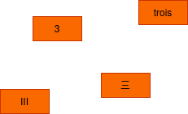
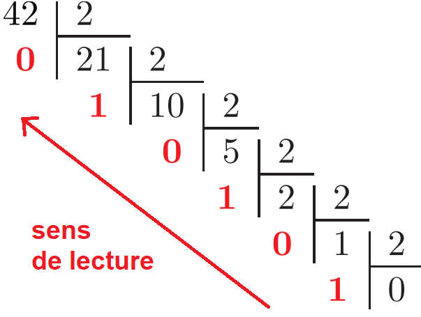

# Représentation des nombres entiers dans une machine  

## Introduction  

L'informatique est la science qui s'intéresse à la représentation de l'information.  
Par exemple, imaginons un programme qui s'occupe de créer les classes et les emplois du temps des élèves selon leurs options et leurs spécialités.  
Ce programme va devoir s'intéresser en premier lieu à représenter ce qu'est :
- "un élève" (un nom, un prénom, une date de naissance, ...)
- "une classe" (une liste d'élèves, un nom de classe, ...)
- "un emploi du temps" (une liste de créneau horaire, ... )

Au début de l'informatique, il a évidemment fallut s'attaquer à la représentation d'informations beaucoup plus élémentaire, comme __les nombres entiers__ par exemple. 

## Représentation des nombres de manière générale  

  

Cette image nous montre le nombre 3 représenté dans la langue française, en nombre latin, en base décimal et enfin en sinogrammes mandarin. 

Le but de ce cours est de s'intéresser à la représentation des nombres __en binaire__ (on dit également __base 2__).  

## Les nombres écrits en décimale

L'être humain compte en décimale (ou base 10). Il est fort probable que l'utilisation de cette base est due au fait que la nature nous a dotés de dix doigts.  

Voyons les particularités de la base 10.   
- On utilise 10 chiffres pour écrire les nombres. $\set{0, 1, 2, 3, 4, 5, 6, 7 ,8 ,9}$  
- Chaque nombre écrit en base 10 est une décomposition de puissance de 10 :

    Par exemple le nombre $4623$ peut se décomposer de la manière suivante  
    $4 \times 1000 + 6 \times 100 + 2 \times 10 + 3 \times 1$    
    $4 \times 10³ + 6 \times 10² + 2 \times 10¹ + 3 \times 10⁰$    

On récupère le chiffre qui sert de facteur devant chaque puissance de 10(ici 4, 6, 2 et 3) puis on les écrits les uns à la suite des autres. On obtient ainsi `4623`.    

## Les nombres écrits en binaire  

Pour représenter les nombres en binaire on utilise le même procédé qu'en décimal à quelques exceptions près.
Voyons les particularités de la base 2.   
- On utilise 2 chiffres pour écrire les nombres. $\set{0, 1}$    
- Chaque nombre écrit en base 2 est une décomposition de puissance de 2 :   

    Par exemple le nombre $37$ peut se décomposer de la manière suivante    
    $1 \times 32 + 0 \times 16 + 0 \times 8 + 1 \times 4 + 0 \times 2 + 1 \times 1$  
    $1 \times 2⁵ + 0 \times 2⁴ + 0 \times 2³ + 1 \times 2² + 0 \times 2¹ + 1 \times 2⁰$  

    De la même manière que pour la base 10, on récupère le chiffre qui sert de facteur devant chaque puissance de 2(ici 1, 0, 0, 1, 0 et 1) puis on les écrits les uns à la suite des autres. On obtient ainsi `100101`.    

La décomposition des nombres en puissance de 2 se fait de manière croissante si on commence à lire le nombre par la droite.  

## Lecture d'un nombre écrit en binaire (de la base 2 à la base 10)   

Pour lire un nombre écrit en binaire il est utile d'utiliser la décomposition en puissance de 2 vu précédemment.    

Prenons par exemple le nombre écrit en binaire suivant `10101`. Nous voulons savoir à quel nombre écrit en décimal ce nombre écrit en binaire correspond.    

Il suffit de décomposer sous forme de puissance de 2 ce nombre.   
On a donc :    
    $1 \times 2⁴ + 0 \times 2³ + 1 \times 2² + 0 \times 2¹ + 1 \times 2⁰$    
    $1 \times 16 + 0 \times 8 + 1 \times 4 + 0 \times 2 + 1 \times 1$    
    $16 + 4 + 1$  
    $21$   

Ainsi le nombre `10101` s'écrit en décimal `21`

## Écriture en binaire d'un nombre écrit en décimal (de la base 10 à la base 2)    

Pour écrire un nombre décimal en base 2 il faut utiliser la méthode des divisions successives.  

Voici la méthode :  
- On prend le nombre en base 10  
- On le divise par 2 et on note le reste de la division (soit 1 soit 0)  
- On refait la même chose avec le quotient précédent, et on met de nouveau le reste de côté.  
- On réitère la division, jusqu'à ce que le quotient soit 0.  
- Le nombre en binaire apparaît alors : il suffit de prendre tous les restes de bas en haut.  

Voici l'application de la méthode afin de trouver l'écriture binaire du nombre `42` :  
  

Ainsi le nombre `42` s'écrit en binaire `101010`.  

