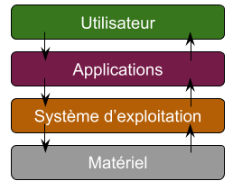
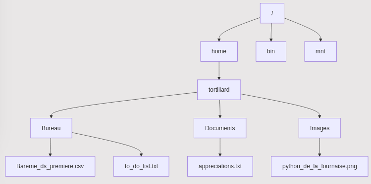

# Système d'exploitation  

Un système d'exploitation (Operating System ou OS en anglais) est un logiciel essentiel qui gère le matériel d'un ordinateur et permet aux utilisateurs d'interagir avec celui-ci. Il sert d'interface entre l'utilisateur et le matériel, facilitant ainsi l'exécution des applications.
Fonctions d'un système d'exploitation

## Fonctions d'un système d'exploitation  

Les principales fonctions d'un système d'exploitation incluent :

- __Gestion des ressources matérielles__ : Le système d'exploitation gère les ressources matérielles de l'ordinateur, telles que le processeur, la mémoire, le disque dur et les périphériques (imprimantes, souris, etc.). Il alloue ces ressources aux différentes applications en cours d'exécution.

- __Gestion des fichiers__ : Le système d'exploitation organise et gère les fichiers sur le disque dur. Il permet aux utilisateurs de créer, lire, modifier et supprimer des fichiers, tout en assurant la sécurité et l'intégrité des données.

- __Gestion des processus__ : Le système d'exploitation gère l'exécution des programmes en cours. Il crée, planifie et termine les processus, assurant ainsi un fonctionnement fluide et efficace des applications.

- __Interface utilisateur__ : Le système d'exploitation fournit une interface utilisateur, qui peut être graphique (GUI) ou en ligne de commande (CLI), permettant aux utilisateurs d'interagir avec le système et d'exécuter des commandes.

- __Sécurité et gestion des accès__ : Le système d'exploitation assure la sécurité des données et des ressources en contrôlant l'accès des utilisateurs et en protégeant contre les logiciels malveillants.  

- __Gestion des périphériques d'entrées/sorties__ : Lorsqu'un périphérique est branché il est détecté "automatiquement". C'est grâce au système d'exploitation.  

## Systèmes d'exploitation libres et propriétaire

### Système d'exploitation libre

Il existe plusieurs types de systèmes d'exploitation, qui peuvent être classés en deux grandes catégories : __libres__ et __propriétaires__.

Les systèmes d'exploitation __libres__ sont des logiciels dont __le code source est accessible et modifiable par tous__. Cela permet aux utilisateurs de personnaliser le système selon leurs besoins. Parmi les systèmes d'exploitation libres les plus connus, on trouve :

- __Linux__ : Un système d'exploitation basé sur le noyau Linux, qui est utilisé dans de nombreuses distributions (Ubuntu, Fedora, Debian, etc.). Linux est populaire pour sa stabilité, sa sécurité et sa flexibilité.


### Systèmes d'exploitation propriétaires

Les systèmes d'exploitation propriétaires sont des logiciels dont __le code source est fermé et contrôlé par une entreprise__. Les utilisateurs doivent acheter une licence pour utiliser ces systèmes. Parmi les systèmes d'exploitation propriétaires les plus connus, on trouve :

- __Microsoft Windows__ : Le système d'exploitation le plus utilisé dans le monde, connu pour sa compatibilité avec de nombreux logiciels et matériels.

- __macOS__ : Le système d'exploitation développé par Apple pour ses ordinateurs Mac. Il est apprécié pour son interface utilisateur élégante et ses fonctionnalités intégrées.


## Interpréteur de commandes

__Un interpréteur de commandes (ou shell)__ est un programme qui permet aux utilisateurs d'interagir avec le système d'exploitation en utilisant des commandes textuelles. Il sert d'interface entre l'utilisateur et le système, permettant d'exécuter des programmes, de gérer des fichiers et d'effectuer diverses tâches administratives.

  


- __Exécution de commandes__ : L'interpréteur de commandes prend les instructions saisies par l'utilisateur et les exécute. Par exemple, lorsque vous tapez ls, l'interpréteur exécute la commande pour lister les fichiers dans le répertoire courant.

- Gestion des scripts : Les utilisateurs peuvent écrire des scripts (fichiers contenant une série de commandes) pour automatiser des tâches répétitives. Ces scripts peuvent être exécutés directement dans l'interpréteur.

- Navigation dans le système de fichiers : L'interpréteur permet de naviguer dans les répertoires, de créer, supprimer ou modifier des fichiers et des dossiers.


## Commandes de base
Voici quelques commandes de base que vous pouvez utiliser dans un terminal.

> [!WARNING]
> Les commandes présentées ci-dessous fonctionnent pour les systèmes basés sur Unix, comme Linux ou macOS. Elles sont souvent invalides sur les systèmes Windows.  

- __ls__ : Affiche la liste des fichiers et des dossiers dans le répertoire courant.
```bash
ls
```
- __cd__ : Change le répertoire courant. Par exemple, pour accéder au dossier "Documents" :
```bash
cd Documents
```
- __mkdir__ : Crée un nouveau dossier. Par exemple, pour créer un dossier nommé "NouveauDossier" :
```bash
mkdir NouveauDossier
```

- __touch__ : Crée un nouveau fichier. Par exemple, pour créer un fichier nommé "nouveau_fichier.py" :
```bash
touch nouveau_fichier.py
```

- __rm__ : Supprime un fichier. Par exemple, pour supprimer un fichier nommé "fichier.txt" :

```bash
rm fichier.txt
```

- __cat__ : Affiche le contenu d'un fichier. Par exemple, pour afficher le contenu du fichier nommé "fichier.txt" :

```bash
cat fichier.txt
```

- __cp__ : Copie un fichier. Par exemple, pour copier "fichier.txt" vers "copie_fichier.txt" :

```bash
cp fichier.txt copie_fichier.txt
```

- __mv__ : Déplace un fichier. Par exemple, pour déplacer "fichier.txt" dans le dossier "Nouvel_emplacement" on écrira:
```bash
mv fichier.txt Nouvel_emplacement
```


Certains sites listes toutes les commandes linux disponible : 

- https://doc.ubuntu-fr.org/tutoriel/console_commandes_de_base
- https://www.hostinger.fr/tutoriels/commandes-linux


## Chemins absolus et relatifs  

### Chemins Absolus

Un __chemin absolu__ est un chemin qui décrit l'emplacement d'un fichier ou d'un dossier à partir de la __racine du système de fichiers__. Il commence généralement par un séparateur de répertoire, comme `/` sur les systèmes Unix/Linux ou `C:\` sur Windows.  

On considère l'arborescence sur un système _Linux_ suivante pour tous les exemples : 


> [!TIP]
>__Exemples__ :  
    >Chemin absolu du fichier `appreciations.txt` sur Linux : `/home/tortillard/Documents/appreciations.txt`  
    >L'équivalent sur Windows serait : `C:\Utilisateurs\tortillard\Documents\appreciations.txt`  

Il existe __un seul et unique chemin absolu vers chaque fichier__, on peut donc l'écrire, peu importe où l'on se trouve dans l'arborescence des fichiers.

### Chemins Relatifs

Un __chemin relatif__, en revanche, est un chemin qui décrit l'emplacement d'un fichier ou d'un dossier par rapport au répertoire courant(dans lequel on se trouve). Il ne commence pas par un séparateur de répertoire et utilise souvent des notations comme `.` (répertoire courant) et `..` (répertoire parent).

On considère la même arborescence que précédemment. 

> [!TIP]
>__Exemples__ :  
    >Voici des exemple de chemins relatifs vers le fichier `appreciations.txt` si on se trouve dans le répertoire `/home/tortillard`.
    >- `Documents/appreciations.txt`
    >- `../tortillard/Documents/appreciations.txt`
    >- `Bureau/../Documents/appreciations.txt`
   
Il y a donc __plusieurs chemins relatifs vers un fichier__ selon où l'on se situe dans l'arborescence. Les chemins relatifs sont plus courts et donc plus utilisés lorsque l'on utilise un terminal de commande quotidiennement.
