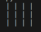
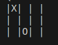
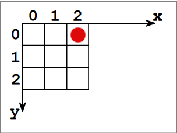

# Exercices POO

## Exercice Morpion 
Le but de cet exercice est de programmer le jeu du Morpion. 
Pour ce faire créer un dossier `Morpion`.
Puis créer dans ce dossier le fichier `Grille.py` et `Jeu.py`

### 1.

Nous allons créer la classe `Grille` dans le fichier `Grille.py`.
Cette classe permet de créer une grille vide mais également d'avoir une représentation sous forme de chaine de caractères de notre jeu.  

### 2.
On commence par définir un attribut nommé `tableau` qui sera la représentation de notre grille sous forme de liste de listes de taille 3x3.  
Initialement une grille est vide, on représente une case vide dans l'attribut `tableau` par `0`.  

### 3.
Maintenant, nous allons nous occuper de la représentation sous forme de chaine de caractère de notre grille.  

Dans notre tableau, on convient de définir   
- une case vide par le nombre `0`    
- une case joué par le joueur `1` par le nombre `1`   
- une case joué par le joueur `2` par le nombre `-1`   

Cette représentation permettra de simplifier le code plus tard.  

Le code qui permettra cela, sera écrit dans une méthode que l'on nommera `__str__`.  

> [!TIP]
> En Python, il existe des méthodes _magiques_ 
> Les méthodes magiques s'écrivent sous la forme `__nom_methode_magique__`.  
> Ces méthodes sont dites magiques car elles peuvent être appelés autrement qu'avec la notation pointé suivie de leur nom.
> Prenons par exemple la variable `g` qui contient une instance de la classe `Grille` la méthode magique `__str__` peut être appelé :
> - comme cela `str(g)`

__La méthode `__str__` doit renvoyer une chaine de caractère__ !
Voici un exemple de renvoi pour une grille vide    

Un autre exemple pour une grille après que le joueur 1 est placé un `X` dans la case `0,0` et le second joueur un `O` dans la case `1,2`.   

Info :   
- Pour concaténer(ou 'coller') deux chaines de caractères on utilise `+`. Par exemple, `"bon" + "jour"` donne `"bonjour"`.    
- `\n` est le caractère de saut à la ligne. Par exemple, le code `print("bonjo\nur")` donne `bonjo` sur la première ligne et `ur` sur la seconde.    
- Pour représenter les bords d'une case on utilise le caractère `|` disponible en le copiant ou en appuyant sur la touche `alt gr + 6`   

### 4.  
La classe `Grille` est maintenant terminé. 
Nous allons créer la classe `Jeu` dans le fichier `Jeu.py`.
Avant-cela on importera la classe `Grille` précédemment créer dans ce fichier.
Pour cela il suffit d'écrire `from Grille import Grille`.  

La classe `Jeu` permet de lancer le jeu du Morpion entre 2 joueurs.   
Elle s'occupe de :
- vérifier si le jeu est terminé.  
- demandez le coup à joué aux joueurs
- vérifiez si le coup est valide
- annoncez le vainqueur !

Commencez par écrire le début de la classe ainsi que son constructeur.  
Pour savoir quel attribut donné à la classe `Jeu` il faut se poser la question : "De quoi à t-on besoin pour jouer au Morpion ?"

### 5.  
Pour pouvoir jouer au morpion il nous faut 2 joueurs, ainsi qu'une grille. 
Ces 3 éléments vont permettre de définir nos 3 attributs pour la classe `Jeu`.  

Ici, les joueurs seront représentés uniquement par leurs noms que l'on précisera lors de la création d'un `Jeu`.  

### 6.
La classe `Jeu` s'occupe de différents points comme énoncé dans l'exercice 4. Il faut écrire les méthodes nécessaire pour s'occuper de tout cela.  

Premièrement, nous allons demandez aux joueurs de saisir les __cordonnées__ de la case dans laquelle il souhaite placé leurs symbole. 

En informatique, on désigne les coordonnées d'une case en plaçant l'origine du repère en haut à gauche.  

Ainsi, pour placer un symbole dans la case rouge le joueur devra rentrer la cordonnées `2,0`  

écrire une méthode nommée `saisie_to_tuple(self, choix_joueur)` qui prend une chaine de caractère nommée `choix_joueur` représentant les cordonnées d'une case.    
Cette méthode renvoi un tuple où le premier entier est la cordonnée `x` et le second la cordonnée `y`.  

Par exemple : `grille.saisie_to_tuple("1,2")` doit renvoyer `(1, 2)`

### 7.  
Lorsqu'un joueur rentre des cordonnées il faut vérifier que la case choisie est bien vide.  
Pour cela, nous allons écrire une méthode `case_disponible(self, choix_joueur)` qui renvoi un booléen `True` si la case aux coordonnées `choix_joueur` est vide, `False` sinon. 

### 8.  

Nous allons écrire une méthode qui permet à un joueur de marquer une case. Dans cette méthode nous admettons que la case choisie est vide, il n'est donc pas la peine de vérifier le contenu d'une case.  

La méthode se nomme `marque_case(self, choix_joueur, joueur_actif)` et prend en paramètres :
- `choix_joueur` : une chaine de caractère correspondant aux cordonnées d'une case
- `joueur_actif` : Un entier parmi `1` ou `-1` représentant le marquage d'une case par le premier ou second joueur  

Cette méthode place l'entier `joueur_actif` aux cordonnées `choix_joueur`.

### 9.  
Nous allons écrire la méthode `partie_est_finie(self, g)` qui prend en paramètre une grille `g` et qui renvoie un entier :  
- `0` si la partie n'est pas finie  
- `1` si la partie est gagné par le joueur 1  
- `-1` si la partie est gagné par le joueur 2  
- `5` si on à une égalilté  

On rappel qu'une partie est gagné par un joueur si 3 symbole de ce dernier sont aligné à l'horizontal, vertical ou diagonale.  

### 10.  
Enfin il nous reste à écrire la méthode `joue(self)` qui harmonise toutes les méthodes écrites précédemment pour mettre en oeuvre le jeu.  

Lors de l'appel de cette méthode une partie se lance.  
- Commençant par demander au premier joueur les coordonnées qu'il choisit. 
- Place le symbole si la case est disponible
- etc...