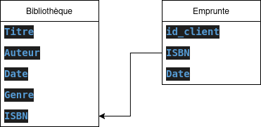
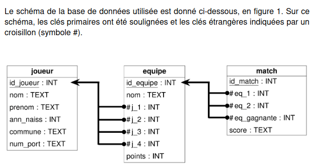

# Modele relationnel  

## Généralités  
En classe de première le chapitre concernant les fichier `csv` nommé  "__traitement de données en table__", nous à permis de comprendre comment une quantité de données importantes pouvait être stocké, manipulé, traité, en utilisant le langage Python ...  
La manipulation des données `csv` est possible lorsqu'on parle d'une petite quantité de données mais cela n'est plus possible pour répondre aux problèmes d'aujourd'hui.  

En effet, la manipulation des données peut être importantes, complexes. Certaines opérations sont plus délicates, par exemple si plusieurs personnes souhaites accéder en même temps à ces données.    

Voilà, pourquoi il est plus judicieux d'utiliser __les bases de données relationnelles__ et d'utiliser un langage propre à leur manipulation le __langage SQL__(qui fera l'objet d'un autre cours).


## Modele relationnel 


## Vocabulaires  

Prenons l'exemple d'une __bibliothèque__ qui permet d'emprunter des livres.  

On représente les livres de la bibliothèque comme ceci : 

```
Bibliothèque = {
    (Le Petit Prince,	Antoine de Saint-Exupéry, 	1943,	Fiction, 2070612742),
    (Les Misérables,	Victor Hugo,	  1862,	Roman, 2070412756),
    (1984, 	George Orwell,	1949,	Dystopie, 0451524935),
    (La Ferme des animaux,	George Orwell,	1945,	Satire politique, 2070412948),
    ...
}
```

> [!NOTE] Relation, enregistrement et attribut  
> Une __relation__(ou __table__) est un tableau de données où chaque ligne représente un __enregistrement__(ou __tuple__) et chaque colonne représente un __attribut__.    
> Par exemple la __relation__ _Bibliothèque_ contient l'__enregistrement__ : _(Les Misérables,	Victor Hugo,	  1862,	Roman, 2070412756)_.  
> L'__attribut__ _Année_ est également présent dans cette relation il représent la 3ème colonne.  

> [!NOTE] Domaine    
> Le __domaine__ correspond au _type_ que peut prendre un _attribut_. 
> Par exemple le __domaine__ de l'attribut _Année_ est un __entier__(int, integer, ...). 
> Le __domaine__ de l'attribut _Titre_ est une __chaine de caractères__(str, string, ...). 

> [!NOTE] Schéma d'UNE relation  
> Le __schéma d'une relation__ contient le nom de la table ainsi que ses attributs (champs) et les types de données de chacun d'eux.  
> Par exemple voici le schéma de la relation _Bibliothèque_ : __Bibliothèque(Titre, Auteur, Date, Genre, ISBN)__

> [!NOTE] Clé primaire (primary key) 
> Une __clé primaire__ est un attribut ou un ensemble d'attributs qui identifie de manière UNIQUE chaque enregistrement dans une table.
> Dans notre exemple, l'_ISBN_ peut être utilisé comme __clé primaire__.
> Une autre __clé primaire__ peut être l'ensemble d'attributs _Titre, Auteur_
> La bonne pratique veut que lorsque plusieurs choix s'offrent à nous pour définir une clé primaire on décide de prendre l'ensemble avec le moins d'attributs et qui ne sera pas modifier dans le temps.  

> [!NOTE] Clé étrangère (foreign key)  
> Une __clé étrangère__ est un attribut dans une table qui fait référence à la _clé primaire_ d'une autre table.  
> Cela permet d'établir une relation entre ces deux relations(tables).  
> Il faut au moins une relation en plus pour illustrer cet exemple.  
> On considère une relation _Emprunte_ avec le schéma suivant __Emprunte(Id_client, ISBN, date)__
> __Ici, l'attribut _ISBN_ est une clé étrangère de la table _Emprunte_ faisant référence à la clé primaire de la table _Bibliothèque_ .__

> [!NOTE] Schéma relationnel
> __Un schéma relationnel__ est la structure d'une base de données. 
> Il inclus toutes les relations entre les tables, les attributs, les clés primaires et étrangères.  
> Par exemple le schéma relationnel de notre base de données composé des 2 tables _Bibliothèque_ et _Emprunte_ est le suivant  
>   
> Voici l'exemple du schéma relationnel d'une autre base de données    
> 


## Contraintes d’intégrité 
(domaine, relation et
référence).