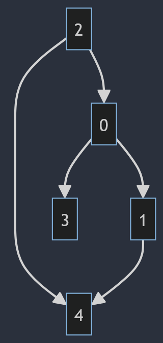

# Graphes  

## Vocabulaire  

Un __graphe__ est une structure de donnée relationnel comportant :  
- un ensemble __d'arrêtes__, généralement noté $E$ (Edges en anglais)  
- un ensemble __de sommets__, généralement noté $V$ (Vertices en anglais)  

Un graphe __non orienté__ est représenté par des arrêtes. 
L'ensemble des __arrêtes__ est constitué de couple symétrique, c'est à dire que pour chaque couple (sommet_1, sommet_2) il existe également le couple (sommet_2, sommet_1)
> Cette situation peut être représentée par le graphe des relations dans un réseau social à liens "d'amitié". (Exemple : Facebook) 

Un graphe __orienté__ est représenté par des arrêtes fléchées nommé __arcs__.  
L'ensemble des __arcs__ est constitué de couple (sommet_1, sommet_2)  
> Cette situation peut être représentée par le graphe des relations dans un réseau social à liens "d'abonnement". (Exemple : Twitter, Youtube)

Dans un graphe non orienté dit que deux sommets sont __adjacents__(ou voisins) si une arrête relie ces deux sommets.
Dans un graphe orienté si une arrête relie (sommet_1, sommet_2) on dit que:
- sommet_2 est un successeur de sommet_1 
- sommet_1 est un prédecesseur de sommet_2 

Dans un graphe on appelle __chemin__ la suite de sommets $s_0, s_1, ... s_f$ tels que $\forall i, 0 \leq i \lt f$, $s_i \space \text{et} \space s_{i+1}$ sont adjacents  

On appelle __cycle__ dans un graphe non orienté (__circuit__ dans un graphe orienté) un chemin tels que le premier et le denier sommet sont identique.

Un graphe est dit __connexe__ si pour chaque sommet $s$ du graphe, il existe un chemin entre $s$ et n'importe quel autre sommet du graphe.  

     

## Représentation d'un graphe en programmation  

### Matrice d'adjacence  

### Liste d'adjacence

## Algorithmique sur les graphes    

### Parcours de graphe  
1. En profondeur d'abord  
2. En largeur d'abord   

### Détection de cycle  

### Recherche d'un chemin dans un graphe    
