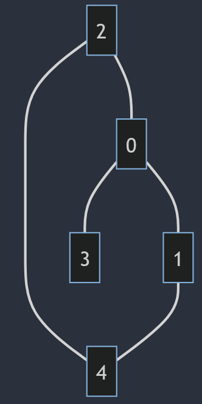

# Graphes  

## Vocabulaire  

Un __graphe__ est une structure de donnée relationnel comportant :  
- un ensemble __d'arêtes__, généralement noté $E$ (Edges en anglais)  
- un ensemble __de sommets__, généralement noté $V$ (Vertices en anglais)  


Un graphe __non orienté__ est représenté par des arêtes. 
L'ensemble des __arêtes__ est constitué de couple symétrique, c'est à dire que pour chaque couple (sommet_1, sommet_2) il existe également le couple (sommet_2, sommet_1)
> Cette situation peut être représentée par le graphe des relations dans un réseau social à liens "d'amitié". (Exemple : Facebook) 


   


Un graphe __orienté__ est représenté par des arêtes fléchées nommé __arcs__.  
L'ensemble des __arcs__ est constitué de couple (sommet_1, sommet_2)  
> Cette situation peut être représentée par le graphe des relations dans un réseau social à liens "d'abonnement". (Exemple : X(anciennement Twitter), Youtube)

  


Dans un graphe non orienté :  
- on dit que deux sommets sont __adjacents__(ou voisins) si une arête relie ces deux sommets.    
- Le nombre de sommets adjacents à un sommet est appelé le __degré__.    

Dans un graphe orienté :  
- si une arête relie (sommet_1, sommet_2) on dit que:  
    - sommet_2 est un __successeur__ de sommet_1   
    - sommet_1 est un __prédecesseur__ de sommet_2   

- le nombre de sommets :  
    - successeur d'un sommet est appelé __degré sortant__  
    - prédécesseur d'un sommet est appelé __degré entrant__  

On appelle __chemin__ la suite de sommets $s_0, s_1, ... s_f$ tels que $\forall i, 0 \leq i \lt f$, $s_i \space \text{et} \space s_{i+1}$ sont adjacents  

On appelle __cycle__ dans un graphe non orienté (__circuit__ dans un graphe orienté) un chemin tels que le premier et le denier sommet sont identique.

Un graphe est dit __connexe__ si pour chaque sommet $s$ du graphe, il existe un chemin entre $s$ et n'importe quel autre sommet du graphe.  


## Représentation d'un graphe en programmation  
On peut représenter les graphes de différentes manières en programmation, il suffit de trouver une structure de donnée adéquat pour représenter l'ensemble des sommets et des arêtes. 

### Matrice d'adjacence  
Une première méthode est d'utiliser une matrice d'adjacence.   
La matrice est de la taille du nombre de sommet du graphe.  
On rempli cette matrice en mettant des `1`(ou `True`) à la i-ème ligne et j-ième colonne s'il existe une arête entre les sommets i et j, sinon on mets des `0`(ou `False`). 
Si les sommets i et j sont des lettres on leur associe un indice, généralement dans l'ordre alphabétique. 
En python on représentera les matrices sous forme de liste de listes.

Exemple :   
   

```Python
graphe = [
    [0 ,   1 ,   1,   1 ,   0],
    [1 ,   0 ,   0,   0 ,   1],
    [1 ,   0 ,   0,   0 ,   1],
    [1 ,   0 ,   0,   0 ,   0],
    [0 ,   1 ,   1,   0 ,   0]  ]
```


### Listes d'adjacences
On représente un graphe sous forme de liste d'adjacence en associant à chaque sommet une liste constituée des noms des sommets qui lui sont adjacents.  
En python on représentera les listes d'adjacence sous forme de dictionnaire.


```Python
graphe = {
    0 : [1,2,3],
    1 : [0,4],
    2 : [0,4],
    3 : [0],
    4 : [1,2],
}
```


## Algorithmique sur les graphes    

### Parcours en profondeur d'abord  
Comme pour le parcours des arbres, on parcours un graphe en profondeur d'abord à partir d'un sommet s.

- On visite v (s'il existe v est un voisin de s non visité)
- Puis v_v (s'il existe v_v est un voisin de v non visité)  
- ...
  
Et ça tant que __tout__ les sommets n'ont pas étaient visités. 

Exemple du parcours en profondeur d'abord à partir du sommet 1 en considérant la représentation sous forme de liste d'adjacence précédente.    
`1 -> 0 -> 2 -> 4 -> 3`


### Parcours en largeur d'abord  
Comme pour le parcours des arbres, on parcours un graphe en largeur d'abord à partir d'un sommet s.

- On visite v_1 un voisin de s (si il existe)
- Puis on visite v_2 un autre voisin de s (si il existe)
- ...
- Puis on visite v_1_1 un voisin de v_1 (si il existe)
- Puis on visite v_1_2 un autre voisin de v_1 (si il existe)
- ...

Exemple du parcours en largeur d'abord à partir du sommet 1 en considérant la représentation sous forme de liste d'adjacence précédente.    
`1 -> 0 -> 4 -> 2 -> 3`


### Détection de cycle  


### Recherche d'un chemin dans un graphe    
