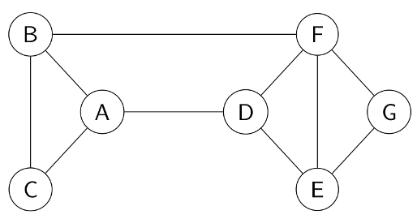
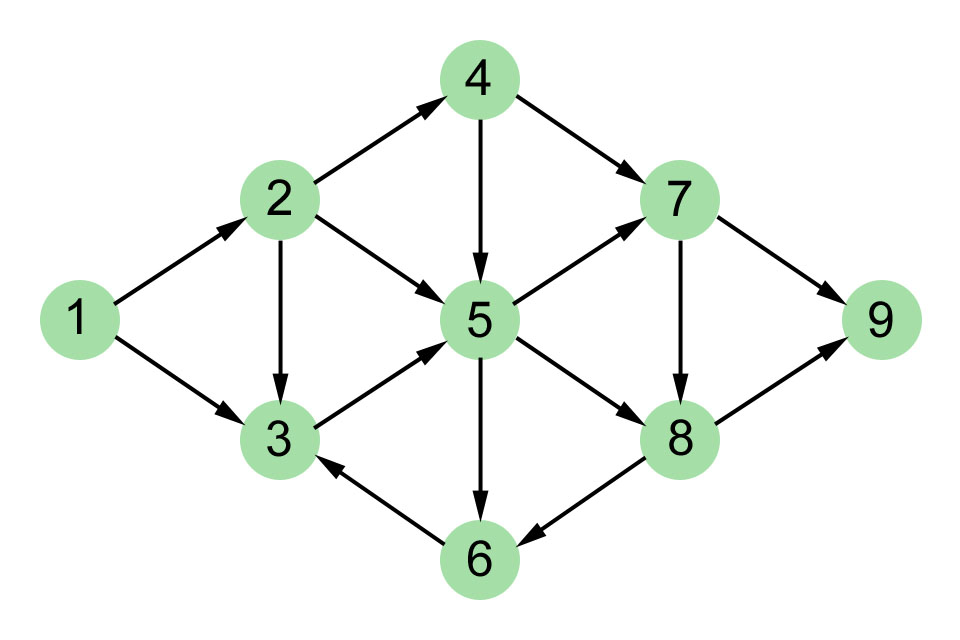

# Exercices  

## Exercice 1  
1. Dessiner tous les graphes non orientés ayant exactement 3 sommets. 
2. Combien y a-t-il de graphe orientés ayant exactement trois sommets ?

## Exercice 2  

Donner pour ce graphe:  
1. Le nombre de sommets  
2. Le degré du sommet A  
3. 3 chemins différents allant de A à F   
4. Un cycle commençant  par le sommet F  
5. Représenter ce graphe sous forme de matrice d'adjacence  

## Exercice 3  

Donner pour ce graphe:
1. Le nombre de sommets  
2. Le degré sortant du sommet 8  
3. Le degré entrant du sommet 5
4. Les chemins allant de 1 à 5   
5. Un cycle commencant par le sommet 3  
6. Représenter ce graphe sous forme de listes d'adjacences  

## Exercice 4  
On décide de représenter un réseau routier sous forme de graphe afin d'avoir une visualisation des routes entre les villes.  
On considères que chaque route ne peut être empruntée que dans 1 sens.   
Il existe une route entre Arras et Beaurains et une route allant de Duisans à Beaurains.
Depuis Beaurains, 3 autres routes sont disponibles, une pour aller à Croisilles, une autre à Duisans et enfin une à Eterpigny.  
On peut aller de Fampoux à Duisans et d'Eterpigny à Fampoux.  
Enfin, il existe une route de Gavrelle à Arras et de Croisilles à Gavrelle.  

1. Dessiner le graphe correspondant à cette description  
2. Donner le nom de 2 villes adjacentes dans ce graphe  
3. Est-il possible d'aller d'Arras à Eterpigny ? De Duisans à Croisilles ? De Croisilles à Gavrelle ? Pour chaque réponse donnée la liste des villes empruntées si c'est possible

## Exercice 5
Programmer la fonction `nb_sommets(g)` prenant en paramètre un graphe sous forme de listes d'adjacences et qui renvoie le nombre de sommet de g. 

## Exercice 6
Programmer la fonction `nb_aretes(g)` prenant en paramètre un graphe(orienté) sous forme de listes d'adjacences et qui renvoie le nombre d'arêtes de g. 

## Exercice 7
Programmer la fonction `degre(g, s)` prenant en paramètre un graphe sous forme de listes d'adjacences et qui renvoie le degré du sommet `s`

## Exercice 8
Programmer la fonction `liste_to_matrice(g)` prenant en paramètre un graphe sous forme de listes d'adjacences et qui renvoie le graphe représenté sous forme de matrice d'adjacence constituée de 0 et de 1.

## Exercice 9 
Réecrivez les fonctions des exercices 5 à 7 prenant en paramètre un graphe sous forme de matrice d'adjacences.  

## Exercice 10  
Programmer la fonction `matrice_to_liste(g)` prenant en paramètre un graphe sous forme de matrice d'adjacences constitué de 0 et de 1 et qui renvoie le graphe représenté sous forme de listes d'adjacence.  

## Exercice 11 
Programmer la fonction `est_adjacent(g, s1, s2)` prenant en paramètre un graphe représenté par des listes d'adjacences ainsi que 2 sommets du graphe et qui renvoie True si `s1` et `s2` sont adjacent dans le graphe `g`

## Exercice 12  
Programmer la fonction `est_chemin(g, c)` prenant en paramètre un graphe représenté par des listes d'adjacences et `c` un chemin représenté par une liste de sommet. Cette fonction renvoie True si `c` est un chemin de `g`.   

## Exercice 13 
Programmer la fonction `parcours_profondeur(g, s)` prenant en paramètre un graphe sous forme de listes d'adjacences et qui renvoie un parcours en profondeur des sommets de `g` à partir de `s`. Le parcours renvoyé sera sous forme de liste de noeuds parcourus.

## Exercice 14 
Programmer la fonction `parcours_largeur(g, s)` prenant en paramètre un graphe sous forme de listes d'adjacences et qui renvoie un parcours en largeur des sommets de `g` à partir de `s`. Le parcours renvoyé sera sous forme de liste de noeuds parcourus.  

## Exercice 15  
Programmer la fonction `possede_cycle(g, s)` qui renvoie True, si il existe un cycle dans `g` qui commence par le sommet `s`.  

## Exercice 16  
Avant de programmer cette fonction il est conseillé de réfléchir à un algorithme _à la main_.

1. Programmer la fonction `recherche_chemin(g, s)` qui renvoi un dictionnaire tel que :
- les clés `k` sont les sommets de `g`.
- les valeurs sont les sommets permettant d'atteindre `k` à partir de `s`.  
Dans le dictionnaire on mettra la valeur de la clé `s` à None. Comme `s` est le sommet de début il ne possède aucun sommet à partir du quel on peut atteindre `s`.  

2. Programmer la fonction `chemin(g, debut, fin)` qui se sert de la fonction `recherche_chemin` et renvoie sous forme de liste les sommets à emprunter du chemin qui commence par le sommet `debut` et termine par le sommet `fin`. 

## 