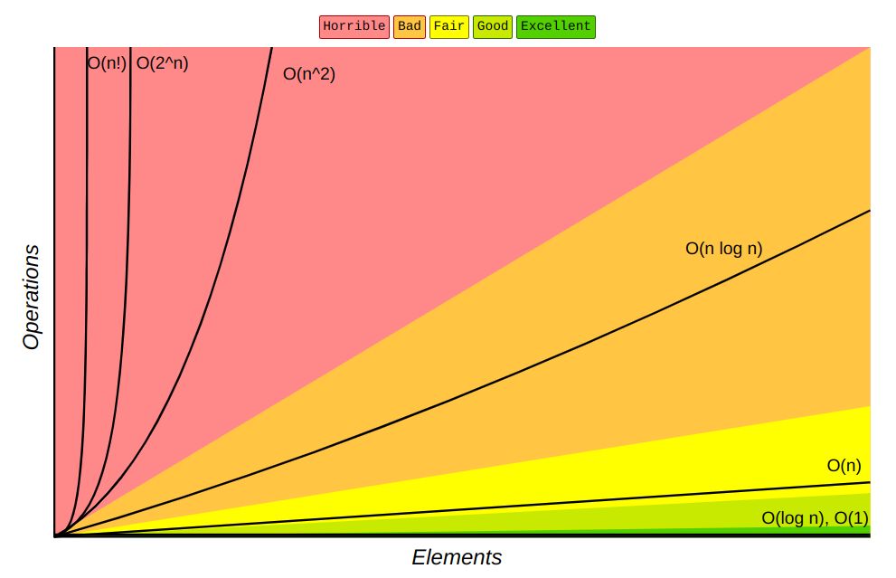

# Complexité algorithmique - Tri fusion

## Généralités  
Trier une collection d'objet signifie, les rangées dans un certain ordre selon une fonction de comparaison. 

Exemple :
    - Les mots du dictionnaire sont rangés dans l'ordre croissant selon la fonction de comparaison qui associe lexicographique(alphabétique)
    - Les résultats obtenue d'une compétition de lancer de poids sont obtenue dans l'ordre décroissant selon la fonction de comparaison qui associe l'ordre numérique 

Dans la suite du cours on décide de choisir comme collection, une liste python d'entiers et que le terme _trier_ désigne le tri dans l'ordre croissant selon l'ordre numérique. 

__Rappel des tris de Première__


## Tri sélection  
Principe :  

A chaque étape on à une partie de la liste qui est triée(gauche) et une autre non triée(droite).

- On sélectionne dans la partie non triée l'entier le plus petit. 
- Puis on place cet entier à la fin de la partie triée


```Pseudo
TRI SELECTION 
ENTREE : L, Une liste d'entiers
SORTIE : La liste d'entiers L triée 


POUR i allant de 0 à longueur(L-1)
    
    indice_minimum = selectionne_indice_minimum(L, i)    # Récupère l'indice de l'élement minimum à partir de l'indice i  
    echange_valeur(L, L[i], L[indice_minimum])   # Permutte les éléments situés aux indices i et indice_minimum de L

RENVOIE L 

```

### Activité 
Programmer le tri sélection en python. 


## Tri insertion  

Principe :  

A chaque étape on à une partie de la liste qui est triée(gauche) et une autre non triée(droite).

- On prends le premier entier de la partie non triée. 
- Puis on le place au bon endroit dans la partie triée.


```Pseudo
TRI INSERTION 
ENTREE : L, Une liste d'entiers
SORTIE : La liste d'entiers L triée 


POUR i allant de 0 à longueur(L-1)
    
    insert(L, i)     # insert l'élément d'indice i dans la partie triée de L

RENVOIE L 

```
### Activité 
Programmer le tri insertion en python. 


## Complexité 

La complexité(ou coût) d'un algorithme est une mesure permettant d'indiquer la quantité de ressource nécessaire d'un algorithme.  
Par ressource on entends principalement soit le _temps_ d'éxécution d'un algorithme ou la place _mémoire_ qu'il occupe. 

- La complexité en __espace__ va compter l'espace mémoire utilisé par un algorithme
- La complexité en __temps__ va compter le temps d'exécution d'un algorithme, relativement aux opérations élémentaires. 

On se contentera uniquement de calculer la complexité en temps.   

Afin d'exprimer la complexité en temps, on compte le nombre d'opérations élémentaire d'un algorithme.    
Les __opérations de comparaison__ (`==`,`!=`,`<`,`<=`,`>`,`>=`) sont les plus significative c'est donc celles ci qui nous intéresserons pour déterminer le coût d'un algorithme.   

### Notations   
La complexité d'un algorithme s'exprime en fonction __de la taille des données d'éntrées__.   
Dans notre cas la donnée d'entrée est la liste. Généralement on utilise `n` pour désigner la taille d'un objet.  

Lorsque l'on compte le nombre d'opération, on simplifie la notation en admettant comme complexité __le plus gros exposant__ compté.  

Par exemple :  
- Si on effectue une comparaison pour chaque donnée de la liste, on compte `n`comparaisons on notera : `O(n)`   
- Si on effectue deux comparaison pour chaque donnée de la liste, on compte `2n`comparaisons on notera : `O(n)`   
- Si on effectue 2n comparaison pour chaque donnée de la liste, on compte `2n²`comparaisons on notera : `O(n²)`   


Voici un graphique des différentes complexités algorithmique les plus rencontrées 

 


### Activité   
1. Programmer une fonction `recherche(tab : list[int], x : int)` qui renvoie l'indice de la première occurence de `x` dans `tab` ou  `-1` si `x` n'est pas dans `tab`. En étudiant votre programme donné sa complexité.
2. En étudiant l'algorithme du tri sélection donné sa complexité.
3. En étudiant l'algorithme du tri insertion donné sa complexité.


## Tri fusion  

Méthode utilisée : Diviser pour régner
Principe : On découpe la liste en 2 afin de séparer le problème et triée des tranches plus petites

1. Première étape : __on découpe__
- Si la liste est de taille inférieur ou égal à 1:
    - On renvoie la liste
- Sinon on coupe la liste en deux sous-listes

2. Deuxième étape : __on fusionne__
- On fusionne chaque sous-liste en les triant 


> Exemple avec la liste `[3,1,4,5,2]` 


```Pseudo
TRI FUSION 
ENTREE : L, Une liste d'entiers
SORTIE : La liste d'entiers L triée 

SI len(L) <= 1:
    return L

SINON:
    L_g, L_d = Separe(L)
    L_g_trie = TRI FUSION(L_g)
    L_d_trie = TRI FUSION(L_d)
    L_trie = Fusionne(L_g_trie, L_d_trie)
    
RENVOIE L_trie

```


### Activité   
Prenons la liste `[4, 2, 7, 5, 1, 9, 8, 3, 6]`
1. Compter le nombre de comparaisons effectuée avec le tri sélection appliqué sur cette liste
2. Compter le nombre de comparaisons effectuée avec le tri insertion appliqué sur cette liste
3. Compter le nombre de comparaisons effectuée avec le tri fusion appliqué sur cette liste
